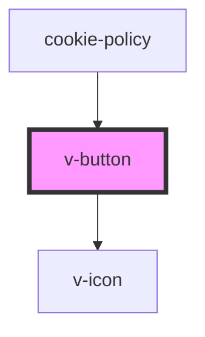

# v-button

<!-- Auto Generated Below -->

## Properties

| Property          | Attribute           | Description                                                                      | Type                                                                                                                                                                                                                                                                                                            | Default     |
| ----------------- | ------------------- | -------------------------------------------------------------------------------- | --------------------------------------------------------------------------------------------------------------------------------------------------------------------------------------------------------------------------------------------------------------------------------------------------------------- | ----------- |
| `appearance`      | `appearance`        | The appearance of the button.                                                    | `"" \| "base" \| "brand" \| "negative" \| "positive"`                                                                                                                                                                                                                                                           | `undefined` |
| `dense`           | `dense`             | Whether the button should have dense padding.                                    | `boolean`                                                                                                                                                                                                                                                                                                       | `undefined` |
| `disabled`        | `disabled`          | Whether the button should be disabled.                                           | `boolean`                                                                                                                                                                                                                                                                                                       | `undefined` |
| `extraClassNames` | `extra-class-names` | Optional class(es) to pass to the button element.                                | `string`                                                                                                                                                                                                                                                                                                        | `undefined` |
| `href`            | `href`              | If this is set, the button will be rendered as a <a> tag with the link provided. | `string`                                                                                                                                                                                                                                                                                                        | `undefined` |
| `inline`          | `inline`            | Whether the button should display inline.                                        | `boolean`                                                                                                                                                                                                                                                                                                       | `undefined` |
| `isProcessing`    | `is-processing`     | Whether the should display a loading spinner.                                    | `boolean`                                                                                                                                                                                                                                                                                                       | `undefined` |
| `prefixIcon`      | `prefix-icon`       | If this is set, the button will be rendered as a <a> tag with the link provided. | `"help" \| "expand" \| "error" \| "success" \| "copy" \| "code" \| "menu" \| "close" \| "plus" \| "minus" \| "collapse" \| "spinner" \| "chevron-down" \| "chevron-up" \| "information" \| "delete" \| "external-link" \| "drag" \| "search" \| "share" \| "user" \| "warning" \| "anchor" \| "show" \| "hide"` | `undefined` |
| `small`           | `small`             | Wether the button should be small.                                               | `boolean`                                                                                                                                                                                                                                                                                                       | `undefined` |
| `suffixIcon`      | `suffix-icon`       | If this is set, the button will be rendered as a <a> tag with the link provided. | `"help" \| "expand" \| "error" \| "success" \| "copy" \| "code" \| "menu" \| "close" \| "plus" \| "minus" \| "collapse" \| "spinner" \| "chevron-down" \| "chevron-up" \| "information" \| "delete" \| "external-link" \| "drag" \| "search" \| "share" \| "user" \| "warning" \| "anchor" \| "show" \| "hide"` | `undefined` |

## Dependencies

### Used by

 - [cookie-policy](../cookie-policy)

### Depends on

- [v-icon](../v-icon)

### Graph

----------------------------------------------

*Built with [StencilJS](https://stenciljs.com/)*
