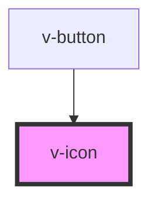

# v-icon

<!-- Auto Generated Below -->

## Properties

| Property     | Attribute     | Description                      | Type                                                                                                                                                                                                                                                                                                            | Default     |
| ------------ | ------------- | -------------------------------- | --------------------------------------------------------------------------------------------------------------------------------------------------------------------------------------------------------------------------------------------------------------------------------------------------------------- | ----------- |
| `icon`       | `icon`        | The name of the icon to display. | `"help" \| "expand" \| "error" \| "success" \| "copy" \| "code" \| "menu" \| "close" \| "plus" \| "minus" \| "collapse" \| "spinner" \| "chevron-down" \| "chevron-up" \| "information" \| "delete" \| "external-link" \| "drag" \| "search" \| "share" \| "user" \| "warning" \| "anchor" \| "show" \| "hide"` | `undefined` |
| `isLight`    | `is-light`    | The name of the icon to display. | `boolean`                                                                                                                                                                                                                                                                                                       | `undefined` |
| `isRotating` | `is-rotating` | The name of the icon to display. | `boolean`                                                                                                                                                                                                                                                                                                       | `undefined` |

## Dependencies

### Used by

 - [v-button](../v-button)

### Graph

----------------------------------------------

*Built with [StencilJS](https://stenciljs.com/)*
